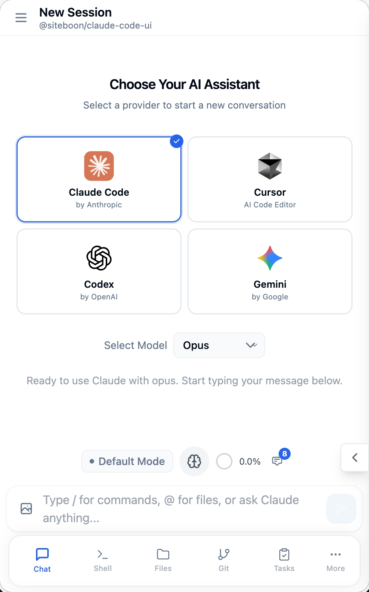

<div align="center">
  
  <h1>Cloud CLI (일명 Claude Code UI)</h1>
  <p><a href="https://docs.anthropic.com/en/docs/claude-code">Claude Code</a>, <a href="https://docs.cursor.com/en/cli/overview">Cursor CLI</a>, <a href="https://developers.openai.com/codex">Codex</a>, <a href="https://geminicli.com/">Gemini-CLI</a> 용 데스크톱 및 모바일 UI입니다.<br>로컬 또는 원격에서 실행하여 어디서나 활성 프로젝트와 세션을 확인하세요.</p>
</div>

<p align="center">
  <a href="https://cloudcli.ai">CloudCLI Cloud</a> · <a href="https://cloudcli.ai/docs">문서</a> · <a href="https://discord.gg/buxwujPNRE">Discord</a> · <a href="https://github.com/siteboon/claudecodeui/issues">버그 신고</a> · <a href="CONTRIBUTING.md">기여 안내</a>
</p>

<p align="center">
  <a href="https://cloudcli.ai"></a>
  <a href="https://discord.gg/buxwujPNRE"></a>
  <br><br>
  <a href="https://trendshift.io/repositories/15586" target="_blank"></a>
</p>

<div align="right"><i><a href="./README.md">English</a> · <a href="./README.ru.md">Русский</a> · <a href="./README.de.md">Deutsch</a> · <b>한국어</b> · <a href="./README.zh-CN.md">中文</a> · <a href="./README.ja.md">日本語</a></i></div>

---

## 스크린샷

<div align="center">

<table>
<tr>
<td align="center">
<h3>데스크톱 보기</h3>

<br>
<em>프로젝트 개요와 채팅을 보여주는 메인 인터페이스</em>
</td>
<td align="center">
<h3>모바일 경험</h3>

<br>
<em>터치 내비게이션이 포함된 반응형 모바일 디자인</em>
</td>
</tr>
<tr>
<td align="center" colspan="2">
<h3>CLI 선택</h3>

<br>
<em>Claude Code, Gemini, Cursor CLI 및 Codex 중 선택</em>
</td>
</tr>
</table>

</div>

## 기능

- **반응형 디자인** - 데스크톱, 태블릿, 모바일을 아우르는 매끄러운 경험으로 어디서든 Agents를 사용할 수 있습니다
- **대화형 채팅 인터페이스** - 내장된 채팅 UI를 통해 에이전트와 자연스럽게 소통
- **통합 셸 터미널** - 셸 기능을 통해 Agents CLI에 직접 접근
- **파일 탐색기** - 구문 강조 및 실시간 편집을 갖춘 인터랙티브 파일 트리
- **Git 탐색기** - 변경 사항 보기, 스테이징 및 커밋. 브랜치 전환 기능 포함
- **세션 관리** - 대화를 재개하고, 여러 세션을 관리하며 기록을 추적
- **플러그인 시스템** - 커스텀 탭, 백엔드 서비스, 통합을 추가하여 CloudCLI 확장. [직접 빌드 →](https://github.com/cloudcli-ai/cloudcli-plugin-starter)
- **TaskMaster AI 통합** *(선택사항)* - AI 중심의 작업 계획, PRD 파싱, 워크플로 자동화를 통한 고급 프로젝트 관리
- **모델 호환성** - Claude, GPT, Gemini 모델 계열에서 작동 (`shared/modelConstants.js`에서 전체 지원 모델 확인)

## 빠른 시작

### CloudCLI Cloud (추천)

가장 빠르게 시작하는 방법 — 로컬 설정 없이도 가능합니다. 웹, 모바일 앱, API 또는 선호하는 IDE에서 이용할 수 있는 완전 관리형 컨테이너화된 개발 환경을 제공합니다.

**[CloudCLI Cloud 시작하기](https://cloudcli.ai)**

### 셀프 호스트 (오픈 소스)

**npx**로 즉시 CloudCLI UI를 실행하세요 (Node.js v22+ 필요):

```bash
npx @siteboon/claude-code-ui
```

**정기적으로 사용한다면 전역 설치:**

```bash
npm install -g @siteboon/claude-code-ui
cloudcli
```

`http://localhost:3001`을 열면 기존 세션이 자동으로 발견됩니다.

자세한 구성 옵션, PM2, 원격 서버 설정 등은 **[문서 →](https://cloudcli.ai/docs)**를 참고하세요

---

## 어느 옵션이 적합한가요?

CloudCLI UI는 CloudCLI Cloud를 구동하는 오픈 소스 UI 계층입니다. 로컬 머신에서 직접 셀프 호스트하거나, CloudCLI Cloud(완전 관리형 클라우드 환경, 팀 기능, 심화 통합 제공)를 사용할 수 있습니다.

| | CloudCLI UI (셀프 호스트) | CloudCLI Cloud |
|---|---|---|
| **적합한 대상** | 로컬 에이전트 세션을 위한 전체 UI가 필요한 개발자 | 어디서든 접근 가능한 클라우드에서 에이전트를 운영하고자 하는 팀 및 개발자 |
| **접근 방법** | `[yourip]:port`를 통해 브라우저 접속 | 브라우저, IDE, REST API, n8n |
| **설정** | `npx @siteboon/claude-code-ui` | 설정 불필요 |
| **기기 유지 필요 여부** | 예 (머신 켜둬야 함) | 아니오 |
| **모바일 접근** | 네트워크 내 브라우저 | 모든 기기 (네이티브 앱 예정) |
| **세션 접근** | `~/.claude`에서 자동 발견 | 클라우드 환경 내 세션 |
| **지원 에이전트** | Claude Code, Cursor CLI, Codex, Gemini CLI | Claude Code, Cursor CLI, Codex, Gemini CLI |
| **파일 탐색기 및 Git** | UI에 통합됨 | UI에 통합됨 |
| **MCP 구성** | UI에서 관리, 로컬 `~/.claude` 설정과 동기화됨 | UI에서 관리 |
| **IDE 접근** | 로컬 IDE | 클라우드 환경에 연결된 모든 IDE |
| **REST API** | 예 | 예 |
| **n8n 노드** | 아니오 | 예 |
| **팀 공유** | 아니오 | 예 |
| **플랫폼 비용** | 무료, 오픈 소스 | 월 $7부터 |

> 둘 다 자체 AI 구독(Claude, Cursor 등)을 그대로 사용합니다 — CloudCLI는 환경만 제공합니다.

---

## 보안 및 도구 구성

**🔒 중요 공지**: 모든 Claude Code 도구는 **기본적으로 비활성화**되어 있습니다. 이는 잠재적인 유해 작업이 자동 실행되는 것을 방지하기 위한 조치입니다.

### 도구 활성화

1. **도구 설정 열기** - 사이드바의 톱니바퀴 아이콘 클릭
2. **선택적으로 활성화** - 필요한 도구만 켜기
3. **설정 적용** - 선호도는 로컬에 저장됨

<div align="center">


*도구 설정 인터페이스 - 필요한 것만 켜세요*

</div>

**권장 방법**: 기본 도구를 먼저 켜고 필요할 때 추가하세요. 언제든지 조정 가능합니다.

---

## 플러그인

CloudCLI는 커스텀 탭과 선택적 Node.js 백엔드가 포함된 플러그인 시스템을 제공합니다. Settings > Plugins에서 Git 저장소에서 플러그인을 설치하거나 직접 빌드할 수 있습니다.

### 이용 가능한 플러그인

| 플러그인 | 설명 |
|---|---|
| **[Project Stats](https://github.com/cloudcli-ai/cloudcli-plugin-starter)** | 현재 프로젝트의 파일 수, 코드 줄 수, 파일 유형 분포, 가장 큰 파일, 최근 수정 파일을 표시 |

### 직접 만들기

**[Plugin Starter Template →](https://github.com/cloudcli-ai/cloudcli-plugin-starter)** — 이 저장소를 포크하여 플러그인 구축. 프런트엔드 렌더링, 실시간 컨텍스트 업데이트, RPC 통신 예제 포함.

**[플러그인 문서 →](https://cloudcli.ai/docs/plugin-overview)** — 플러그인 API, 매니페스트 포맷, 보안 모델 등을 설명.

---

## FAQ

<details>
<summary>Claude Code Remote Control과 어떻게 다른가요?</summary>

Claude Code Remote Control은 이미 로컬 터미널에서 실행 중인 세션으로 메시지를 전송합니다. 이 경우 기계가 켜져 있어야 하고 터미널을 열어 둬야 하며, 네트워크 연결 없이 약 10분 후 타임아웃됩니다.

CloudCLI UI와 CloudCLI Cloud는 Claude Code를 확장하며 별도로 존재하지 않습니다 — MCP 서버, 권한, 설정, 세션은 Claude Code에서 그대로 사용됩니다.

- **모든 세션을 다룬다** — CloudCLI UI는 `~/.claude` 폴더에서 모든 세션을 자동 발견합니다. Remote Control은 단일 활성 세션만 노출합니다.
- **설정은 그대로** — CloudCLI UI에서 변경한 MCP, 도구 권한, 프로젝트 설정은 Claude Code에 즉시 반영됩니다.
- **지원 에이전트가 더 많음** — Claude Code, Cursor CLI, Codex, Gemini CLI 지원.
- **전체 UI 제공** — 단일 채팅 창이 아닌 파일 탐색기, Git 통합, MCP 관리 및 셸 터미널 포함.
- **CloudCLI Cloud는 클라우드에서 실행** — 노트북을 닫아도 에이전트가 실행됩니다. 터미널을 계속 확인할 필요 없음.

</details>

<details>
<summary>AI 구독을 별도로 결제해야 하나요?</summary>

네. CloudCLI는 환경만 제공합니다. Claude, Cursor, Codex, Gemini 구독 비용은 별도로 부과됩니다. CloudCLI Cloud는 관리형 환경을 월 $7부터 제공합니다.

</details>

<details>
<summary>CloudCLI UI를 휴대폰에서 사용할 수 있나요?</summary>

네. 셀프 호스트인 경우 기계에서 서버를 실행하고 네트워크의 아무 브라우저에서 `[yourip]:port`를 열면 됩니다. CloudCLI Cloud는 어떤 기기에서도 열 수 있으며, 네이티브 앱도 준비 중입니다.

</details>

<details>
<summary>UI에서 변경하면 로컬 Claude Code 설정에 영향을 주나요?</summary>

네, 셀프 호스트에서는 그렇습니다. CloudCLI UI는 Claude Code가 사용하는 동일한 `~/.claude` 설정을 읽고 씁니다. UI에서 추가한 MCP 서버가 Claude Code에 즉시 나타납니다.

</details>

---

## 커뮤니티 및 지원

- **[문서](https://cloudcli.ai/docs)** — 설치, 구성, 기능, 문제 해결 안내
- **[Discord](https://discord.gg/buxwujPNRE)** — 도움 및 커뮤니티 참여
- **[GitHub Issues](https://github.com/siteboon/claudecodeui/issues)** — 버그 보고 및 기능 요청
- **[기여 안내](CONTRIBUTING.md)** — 프로젝트 참여 방법

## 라이선스

GNU General Public License v3.0 - 자세한 내용은 [LICENSE](LICENSE) 파일 참조.

이 프로젝트는 GPL v3 라이선스 하에 오픈 소스로 공개되어 있으며 자유롭게 사용, 수정, 배포할 수 있습니다.

## 감사의 말

### 사용 기술
- **[Claude Code](https://docs.anthropic.com/en/docs/claude-code)** - Anthropic 공식 CLI
- **[Cursor CLI](https://docs.cursor.com/en/cli/overview)** - Cursor 공식 CLI
- **[Codex](https://developers.openai.com/codex)** - OpenAI Codex
- **[Gemini-CLI](https://geminicli.com/)** - Google Gemini CLI
- **[React](https://react.dev/)** - 사용자 인터페이스 라이브러리
- **[Vite](https://vitejs.dev/)** - 빠른 빌드 도구 및 개발 서버
- **[Tailwind CSS](https://tailwindcss.com/)** - 유틸리티 우선 CSS 프레임워크
- **[CodeMirror](https://codemirror.net/)** - 고급 코드 에디터
- **[TaskMaster AI](https://github.com/eyaltoledano/claude-task-master)** *(선택사항)* - AI 기반 프로젝트 관리 및 작업 계획

### 스폰서
- [Siteboon - AI powered website builder](https://siteboon.ai)
---

<div align="center">
  <strong>Claude Code, Cursor, Codex 커뮤니티를 위해 정성껏 제작되었습니다.</strong>
</div>
